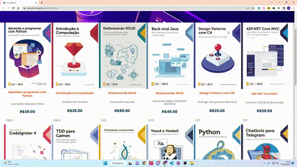

<h1 align="center">
    
    
Alura Books ! 📚

</h1>

<h2>Site baseado no site <a href="https://www.casadocodigo.com.br/">Casa do Código</a></h2>

<h2>Agora você pode acompanhar os livros que estão sendo adicinoados na Alura Books, pesquisar por categoria e buscar por um nome específico</h2>

# 
<a href="https://natanielima.github.io/livrosalura/">Acesse aqui!</a>

## 📖Sobre

Projeto foi desenvolvido durante do curso de <a href="https://cursos.alura.com.br/course/javascript-metodos-array">JavaScript: métodos de array</a> onde buscamos tratar dados de uma API utilizando algumas funções do JavaScript para buscar um determinado título, categoria e até mesmo adicionar livros novos! Tive que fazer algumas adaptações ao projeto do curso como adição de busca por categoria, valores dos livros que aprecem dinamicamente, retrocompatibilidade e a função de adicionar um livro! Veja como ficou e me avalie!!!!!! Todo comentário será bem vindo!

## 🔨 Tecnologias utilizadas

